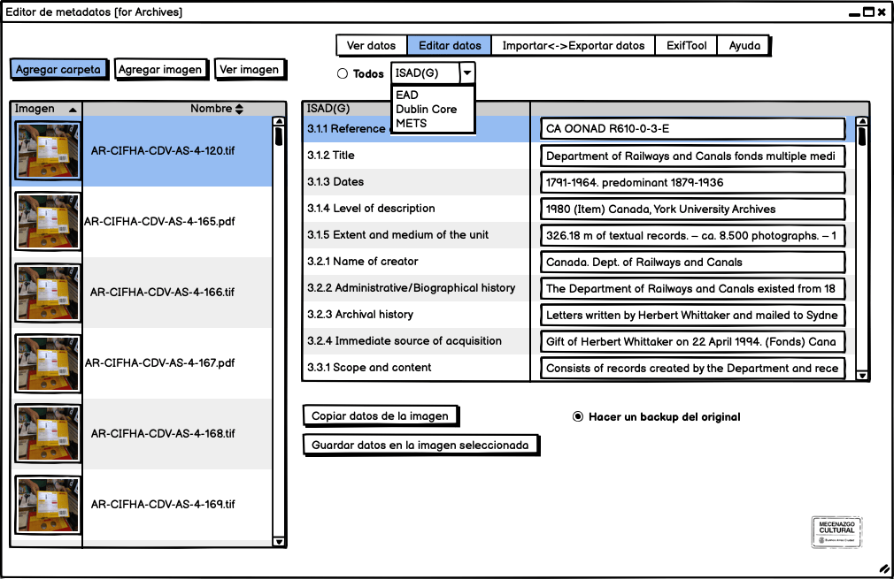
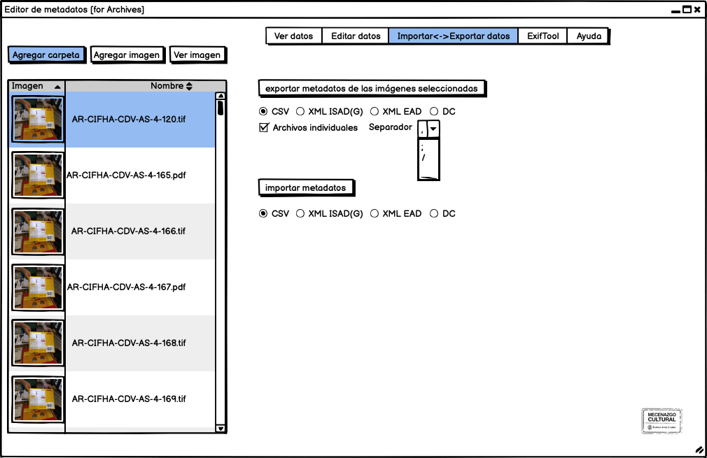

 

Este editor multiplataforma es una interfaz gráfica (basada en Java) para la edición de metadatos de registros de colecciones con las normas [EXIF](https://docs.fileformat.com/image/exif/), [IPTC](https://iptc.org/standards/photo-metadata/), [XMP](https://www.adobe.com/products/xmp.html), GPS y extendido a [Dublin Core](https://dublincore.org/specifications/dublin-core/) y [ISAD(G) 2000](https://www.ica.org/sites/default/files/CBPS_2000_Guidelines_ISAD%28G%29_Second-edition_EN.pdf).

### Web de Proyecto:  [https://museosabiertos.org/proyectos/editor-metadatos-glam](https://museosabiertos.org/proyectos/editor-metadatos-glam)

## Objetivo
Esta herramienta de edición de metadatos ayuda a implementar las normas archivísticas -dentro del modelo conceptual OAIS [http://www.oais.info].- en una única interfase, donde los metadatos quedan 'grabados' en los documentos, evitando así la dispersión de soluciones y colaborando con la estandarización de los procesos y la aplicación de las normas y acelerando los procesos de registro de colecciones incorporando metodologías normalizadas.

Este proyecto -libre y abierto- está orientado a todas las instituciones -públicas como privadas- donde se resguardan documentos y archivos patrimoniales que y busquen implementar las normas internacionales.

## Características
* Software de código abierto con licencia GNU
* Software multiplataforma (puede ser ejecutado en Windows XP, 7, 10, MacOS, Linux y Raspberry pi)
* Edita los metadatos y los 'guarda' dentro del archivo sin modificar la imagen (ej.: JPG, TIF, PDF) conservando su contexto al 'viajar' a través de aplicaciones, dispositivos y bases de datos.
* Edita metadatos según las normas internacionales ISAD(G) 2000 y DC
* No es destructivo (no altera las imágenes)
* Reduce significativamente las tareas de registro
* Aunque lo permite, hace obsoleto el uso de hojas de cálculo independientes para el registros de colecciones
* Diseñado para adaptarse a un flujo de trabajo para auditoría de datos con [Open Refine](https://openrefine.org/)
* Exporta los metadatos a un archivo tabulado CSV o PDF para facilitar la ingestión en aplicaciones, como [AtoM](https://accesstomemory.org/), [Archivematica](https://www.archivematica.org/), [DSpace](https://duraspace.org/dspace/), [Fedora Commons](https://duraspace.org/fedora/) o [RODA](https://roda-community.org/).

## Roadmap
* Importa un CSV o XML y guarda los metadatos en archivos (ej.: JPG, TIFF, PDF) 
* Lectura/escritura de metadatos en un archivo XML externo (sidecar)
* Guarda un histórico de ediciones
* Soporte para [VRA Core 4](https://core.vraweb.org/)
* Soporte para [EAD 2002](https://www.loc.gov/ead/index.html)
* Soporte para [EAD3 (2015)](https://www.loc.gov/ead/index.html)
* Soporte para [DACS](https://www.dcc.ac.uk/guidance/standards/diffuse/show?standard_id=146&sort=title)
* Soporte para [SPECTRUM](https://collectionstrust.org.uk/spectrum/)

## Software
Aplicación Java/Swing que funciona como frontend gráfico (GUI) para ExifTool. La UI está diseñada con GUI Designer from IntelliJ IDEA. Licencia abierta, GNU General Public License.

Este desarrollo se apoya en estándares y software de código abierto de terceras partes

* [EXIF](https://docs.fileformat.com/image/exif/) es un estándar creado en el año 1995 para las especificaciones de formatos de imagen y sonido utilizados principalmente por cámaras digitales y escáneres, creado por la [_Asociación de la industria de cámaras de Japón_](https://en.wikipedia.org/wiki/Japan_Electronic_Industries_Development_Association) y hoy cuenta con una total aceptación y soporte.
* Viendo las limitaciones de EXIF, en el año 2001 Abobe System creó [XMP](https://es.wikipedia.org/wiki/XMP), un modelo de datos extensibles, con el fin de poder registrar metadatos, como [Dublin Core](https://es.wikipedia.org/wiki/Dublin_Core), pero con el objetivo de aplicarlo a los archivos PDF. Hoy en día puede ser utilizado en prácticamente cualquier formato gráfico y es un framework extensible a otras aplicaciones.
* [ExifTool by Phil Harvey](https://exiftool.org/) es una biblioteca de Perl multiplataforma, creada en el año 2003, más una aplicación de línea de comandos para leer y editar metainformación en una amplia variedad de archivos, que es usada por muchas aplicaciones de código abierto que deban escribir metadatos.
* [ISAD(G) XML Schema](https://gist.github.com/anarchivist/826364)* 

### Dependencias
* [JRE (Java Runtime Environment)](https://adoptopenjdk.net/releases.html)
* [ExifTool by Phil Harvey](https://exiftool.org/) 

## Mockups

## Proyectos similares
* [jExifToolGUI](https://github.com/hvdwolf/jExifToolGUI)
* [Tropy](https://tropy.org/)
* [Custom Metadata Panel for Bridge](https://github.com/adobe-dmeservices/custom-metadata)

## GLAM Metadata standards

| Standard                        | Descripción                         | 
| :-------------------------- | :---------------------------: | 
| [Dublin Core](https://www.dublincore.org/) | El formato de "mínimo común denominador" adecuado para quienes experimentan con estrategias de catalogación o con requisitos simples de catalogación.|
|[Darwin Core](https://dwc.tdwg.org/) | El estándar Darwin Core se concibió originalmente para facilitar el descubrimiento, la recuperación y la integración de información sobre especímenes biológicos modernos, su ocurrencia espacio-temporal y su evidencia de apoyo almacenada en colecciones (físicas o digitales). El Darwin Core hoy tiene un alcance más amplio y es más versátil. Su objetivo es proporcionar una referencia estándar estable para compartir información sobre diversidad biológica. Como glosario de términos, el Darwin Core está destinado a proporcionar definiciones semánticas estables con el objetivo de ser reutilizable al máximo en una variedad de contextos.|
|[EBU Core](https://tech.ebu.ch/publications/tech3293) | Basado en Dublin Core, EBUCore es una lista mínima de atributos para describir recursos de audio y video para una amplia gama de aplicaciones de radiodifusión, incluyendo archivos, intercambio y publicación.|
|[PBCore](https://pbcore.org/) | De PBCore.org: El PBCore (Diccionario de metadatos de radiodifusión pública) fue creado por la comunidad de radiodifusión pública en los Estados Unidos de América para su uso por radiodifusores públicos y comunidades relacionadas. Al igual que EBUCore, la especificación de metadatos PBCore se basa en Dublin Core, enfatizando la descripción de recursos de audio y video en entornos de producción, archivo y transmisión.|
|[CDWA-Lite / CCO](https://www.getty.edu/research/publications/electronic_publications/cdwa/cdwalite.pdf) | Desde el sitio web de CDWA: CDWA Lite es un esquema XML para describir los registros básicos de obras de arte y cultura material basado en las Categorías para la descripción de obras de arte (CDWA) y Catalogación de objetos culturales: una guía para describir las obras culturales y sus Imágenes (CCO). CA se puede configurar para implementar el formato del esquema XML en su base de datos relacional. (Para quienes llevan la puntuación: CA no almacena datos CDWA en formato XML, pero podrá exportar datos en dicho formato en la primera versión de la función de exportación de datos).|
|[EAD](https://www.loc.gov/ead/) | Se utiliza ampliamente en los Estados Unidos como un estándar de datos para encontrar ayudas producidas por archivos, bibliotecas, museos y repositorios de manuscritos.|
|[DACS](https://www2.archivists.org/groups/technical-subcommittee-on-describing-archives-a-content-standard-dacs/describing-archives-a-content-standard-dacs-second-) |	Se usa ampliamente en los Estados Unidos como un estándar de contenido de datos para encontrar ayudas producidas por archivos, bibliotecas, museos y repositorios de manuscritos.|
|[ISAD (G)](http://www.ica.org/?lid=10207) |  Es un estándar de contenido de datos ampliamente utilizado para encontrar ayudas producidas por archivos, bibliotecas, museos y repositorios de manuscritos.|
|[VRA VRA Core 4.0](http://core.vraweb.org/) | Es un estándar de datos para la comunidad del patrimonio cultural que fue desarrollado por el Comité de Estándares de Datos de la Asociación de Recursos Visuales. El conjunto de elementos proporciona una organización categórica para la descripción de obras de cultura visual así como las imágenes que las documentan.|
|[SPECTRUM](https://collectionstrust.org.uk/spectrum/) |  Es un estándar de procedimientos y datos para museos, archivos e instituciones de patrimonio cultural principalmente en el Reino Unido.|

https://www.buenosaires.gob.ar/mecenazgo

## [¡Conocé los proyectos seleccionados!](https://www.buenosaires.gob.ar/cultura/mecenazgo/proyectosaprobados)

## Los contribuyentes pueden ser mecenas de la cultura
Quienes tributen el impuesto sobre los Ingresos Brutos pueden destinar parte del pago de los mismos para financiar proyectos culturales.
https://www.buenosaires.gob.ar/cultura/mecenazgo/informacion-para-contribuyentes

