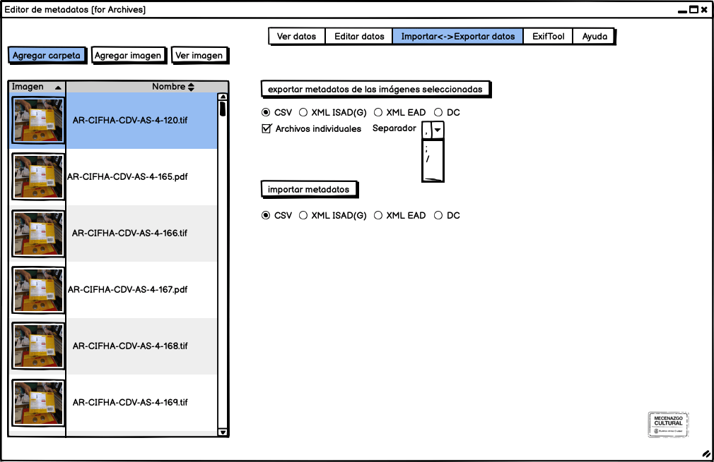
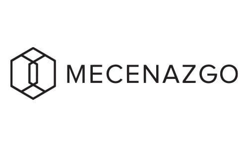

 

Este editor multiplataforma es una interfaz gráfica (basada en Java) para la edición de metadatos de registros de colecciones con las normas [EXIF](https://docs.fileformat.com/image/exif/), [IPTC](https://iptc.org/standards/photo-metadata/), [XMP](https://www.adobe.com/products/xmp.html), GPS y extendido a [Dublin Core](https://dublincore.org/specifications/dublin-core/) y [ISAD(G) 2000](https://www.ica.org/sites/default/files/CBPS_2000_Guidelines_ISAD%28G%29_Second-edition_EN.pdf).

!!!  Web de Proyecto:  [https://museosabiertos.org/proyectos/editor-metadatos-glam](https://museosabiertos.org/proyectos/editor-metadatos-glam)

## Objetivo
Esta herramienta de edición de metadatos -de unidades documentales- ayuda a implementar las normas archivísticas -dentro del modelo conceptual OAIS [http://www.oais.info].- en una única interfase, donde los metadatos se 'incrustan' en los documentos, evitando así la dispersión de soluciones y colaborando con la estandarización y aceleración de los procesos de registro de colecciones, incorporando metodologías normalizadas.

Es especialmente útil para organizaciones pequeñas sin sistemas de administración de activos digitales y organizaciones grandes con muchos contribuyentes individuales, todos los cuales pueden ingresar metadatos
Los metadatos pueden luego transferirse al sistema de gestión de activos digitales.

También ayuda a incorporar a más personas en los flujos de trabajo, como los fotógrafos independientes, que de otro modo no tendrían acceso al sistema de gestión de activos digitales de una organización.

Este proyecto -libre y abierto- está orientado a todas las personas e instituciones que resguardan documentos y archivos patrimoniales, que procuren implementar las normas internacionales.

## Características
* Software de código abierto con licencia GNU
* Software multiplataforma (puede ser ejecutado en Windows XP, 7, 10, MacOS, Linux y Raspberry pi)
* Edita los metadatos y los 'guarda' dentro del archivo sin modificar la imagen (ej.: JPG, TIF, PDF) conservando su contexto al 'viajar' a través de aplicaciones, dispositivos y bases de datos.
* Edita metadatos según las normas internacionales EXIF, IPTC, DC, ISAD(G) 2000, VRA Essential XMP
* No es destructivo (no altera las imágenes)
* Reduce significativamente las tareas de registro
* Aunque lo permite, hace obsoleto el uso de hojas de cálculo independientes para el registros de colecciones
* Diseñado para adaptarse a un flujo de trabajo para auditoría de datos con [Open Refine](https://openrefine.org/)
* Exporta los metadatos a un archivo tabulado CSV o PDF para facilitar la ingestión en aplicaciones, como [AtoM](https://accesstomemory.org/), [Archivematica](https://www.archivematica.org/), [DSpace](https://duraspace.org/dspace/), [Fedora Commons](https://duraspace.org/fedora/) o [RODA](https://roda-community.org/).

## Software
Aplicación Java/Swing que funciona como frontend gráfico (GUI) para ExifTool. La UI está diseñada con GUI Designer from IntelliJ IDEA. Licencia abierta, GNU General Public License.

Este desarrollo se apoya en estándares y software de código abierto de terceras partes

* [EXIF](https://docs.fileformat.com/image/exif/) es un estándar creado en el año 1995 para las especificaciones de formatos de imagen y sonido utilizados principalmente por cámaras digitales y escáneres, creado por la [_Asociación de la industria de cámaras de Japón_](https://en.wikipedia.org/wiki/Japan_Electronic_Industries_Development_Association) y hoy cuenta con una total aceptación y soporte.
* Viendo las limitaciones de EXIF, en el año 2001 Abobe System creó [XMP](https://es.wikipedia.org/wiki/XMP), un modelo de datos extensibles, con el fin de poder registrar metadatos, como [Dublin Core](https://es.wikipedia.org/wiki/Dublin_Core), pero con el objetivo de aplicarlo a los archivos PDF. Hoy en día puede ser utilizado en prácticamente cualquier formato gráfico y es un framework extensible a otras aplicaciones.
* [ExifTool by Phil Harvey](https://exiftool.org/) es una biblioteca de Perl multiplataforma, creada en el año 2003, más una aplicación de línea de comandos para leer y editar metainformación en una amplia variedad de archivos, que es usada por muchas aplicaciones de código abierto que deban escribir metadatos.
* [ISAD(G) XML Schema](https://gist.github.com/anarchivist/826364)* 

### Dependencias
* [JRE (Java Runtime Environment)](https://adoptopenjdk.net/releases.html)
* [ExifTool by Phil Harvey](https://exiftool.org/) 

### Documentación
* [Planilla de documentación de estándares](https://docs.google.com/spreadsheets/d/1lgJ7bgF3YWYn6RpQe6xPpc2lPtMmsKxhdoTDaipEz4M/edit#gid=1070734913)
* [Issues](https://app.asana.com/0/1199531865244213/board)

## Roadmap
* Importa un CSV o XML y guarda los metadatos en archivos (ej.: JPG, TIFF, PDF) 
* Lectura/escritura de metadatos en un archivo XML externo (sidecar)
* Guarda un histórico de ediciones
* Soporte para [VRA Core 4](https://core.vraweb.org/)
* Soporte para [ISAAR (CPF) 2ªed](https://www.ica.org/es/isaar-cpf-norma-internacional-sobre-los-registros-de-autoridad-de-archivos-relativos-a-instituciones)
* Soporte para [EAD 2002](https://www.loc.gov/ead/index.html)
* Soporte para [EAD3 (2015)](https://www.loc.gov/ead/index.html)
* Soporte para [DACS](https://github.com/saa-ts-dacs/dacs)
* Soporte para [SPECTRUM](https://collectionstrust.org.uk/spectrum/)
* Integración con los vocabularios Getty [AAT](https://www.getty.edu/research/tools/vocabularies/aat/), [TGN](http://www.getty.edu/research/tools/vocabularies/tgn/index.html) y [ULAN](https://www.getty.edu/research/tools/vocabularies/ulan/) 
* * ej.: http://vocab.getty.edu/page/ulan/500085616
* Integracíon con VIAF
* * ej.: [http://viaf.org/viaf/96299826/#Lamelas,_David,_1946]
* Integracíon con WikiData
* * ej.: https://www.wikidata.org/wiki/Q829004

## Mockups

## Proyectos similares
* [jExifToolGUI](https://github.com/hvdwolf/jExifToolGUI)
* [IPTC Releases Cultural Heritage Panel for Metadata Management](https://iptc.org/news/culturalheritagepanel/)
* [Tropy](https://tropy.org/)
* [Custom Metadata Panel for Bridge](https://github.com/adobe-dmeservices/custom-metadata)

## Proyectos relacionados
* [Metadata Extraction Tool](http://meta-extractor.sourceforge.net/)
* [JHOVE](http://jhove.openpreservation.org/)

---

Expediente: 19029867

## Los contribuyentes pueden ser mecenas de la cultura
Quienes tributen el impuesto sobre los Ingresos Brutos pueden destinar parte del pago de los mismos para financiar proyectos culturales.
https://www.buenosaires.gob.ar/cultura/mecenazgo/informacion-para-contribuyentes

