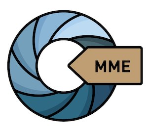

[[ver la versión en español]](https://docs.museosabiertos.org/es/museum-metadata-embedder)

Embed (write) metadata - [Dublin Core](https://dublincore.org/specifications/dublin-core/), [VRA Core](https://core.vraweb.org/), [XMP](https://www.adobe.com/products/xmp.html), [ISAD(G)](https://www.ica.org/sites/default/files/CBPS_2000_Guidelines_ISAD(G)_Second-edition_EN.pdf), [IPTC](https://iptc.org/standards/photo-metadata/), [EXIF](https://docs.fileformat.com/image/exif/) and more - into [all types of images](https://exiftool.org/#supported) and PDF files from a normalized CSV.

**MME** is a Python 3 command line application, which uses [ExifTool](https://exiftool.org/) (by Phil Harvey) and also has a graphical interface, runnable on Linux, MacOS and Windows.

## Use
<code>python mme.py CSV_PATH IMAGES_PATH</code>
Positional arguments: CSV_PATH path to the CSV file to be processed. JPGS_PATH path to the JPG files.
Example: <code> python3 mme.py csv/test.csv images/</code>

### Options
-h, --help show this help message and exit.

--row-progress-notify ROW_PROGRESS_NOTIFY, -r ROW_PROGRESS_NOTIFY
the number of rows between progress notifications. 100 by default.

--notify-broken-keys NOTIFY_BROKEN_KEYS, -n NOTIFY_BROKEN_KEYS
Notify about broken/missing keys in the CSV. False by default.

--max-depth MAX_DEPTH, -m MAX_DEPTH
Maximum depth of subfolders to search for JPGS. 3 by default.

### GMME (GUI)
gmme' is the graphical version of mme.py. It is a python3 script (only). It does not accept arguments.

Use:
<code>python3 gmme.py & </code>

### Repository files
| Path                              | Description                                                       |
| :-------------------------------- | :---------------------------------------------------------------- |
| csv/                               | Suggested folder for hosting CSV files                     |
| csv/test.csv                      | CSV test file for the first run and test            |
| exiftool/                          | Exiftool executable                                               |
| data/exiftool_configs/             | Configuration files for ExifTool                           |
| data/notion_maps_txts/             | Internal work folder -not mandatory-.                    |
| data/maps.json                    | Relationship map between CSV headers and ExifTool tags |
| images/                            | Test files for first run and test               |
| images/vrae_exiftool_example.tiff | VRA Core sample file                                       |
|                                   |                                                                   |

### Configuración personalizada
**MME** utiliza un mapa JSON para mapear el _"Nombre de pantalla" (Encabezado de la columna CSV) <-> "Nombre de etiqueta"_, para cada uno de los estándares. El archivo debe encontrarse dentro del directorio 'data', en un archivo JSON llamado 'maps.json'.
Este archivo se puede editar para agregar nuevas etiquetas.

Sólo es necesario editar las cabeceras (primera fila de la hoja de cálculo) para que se ajusten al esquema. Esto puede implicar la división de algunas columnas para ajustarse al esquema, la adición de columnas y otras ediciones. Todo esto es probablemente más fácil, más rápido y más preciso de hacer en una hoja de cálculo.

### Requerimientos del sistema
|          |                                             |
| -------- | ------------------------------------------- |
| Perl     | https://www.activestate.com/products/perl/  |
| Python 3 | https://www.python.org/downloads/ |

## Descarga
https://github.com/MuseosAbiertos/Museum-Metadata-Embedder

## Agradecimientos
* **Harry van der Wolf**, por su inestimable colaboración y la creación de la interfaz gráfica (GUI) y sus ejecutables multiplataforma
* **Greg Reser**, por todo su apoyo y colaboración en esta implementación de VRA Core
* **Phil Harvey**, por su maravilloso ExifTool, que pronto cumplirá 30 años!
* **Jairo Serrano**, amigo y estimado SysOp que logra que todo funcione sin romperse y lo repara cuando se rompe
* **Sebastián Gersbach**, por el diseño del logo y el paquete de iconos
* **Centro de Documentación de Bienes Patrimoniales de Chile** [https://www.aatespanol.cl/]

## Sponsors/Mecenas
Esta aplicación ha sido posible gracias al programa de Mecenazgo Cultural de la Ciudad Autónoma de Buenos Aires, Argentina

y especialmente a nuestros mecenas

Banco Hipotecario https://www.hipotecario.com.ar
Techniques & Supplies https://www.techniques.com.ar
Digital Ocean https://www.digitalocean.com

