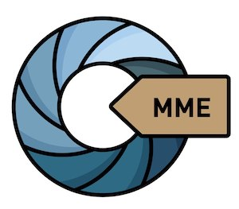

[[go to english version]](https://docs.museosabiertos.org/en/museum-metadata-embedder)

Incrusta (escribe) metadatos -[Dublin Core](https://dublincore.org/specifications/dublin-core/), [VRA Core](https://core.vraweb.org/), [XMP](https://www.adobe.com/products/xmp.html), [ISAD(G)](https://www.ica.org/sites/default/files/CBPS_2000_Guidelines_ISAD(G)_Second-edition_EN.pdf), [IPTC](https://iptc.org/standards/photo-metadata/), [EXIF](https://docs.fileformat.com/image/exif/) y otros más- en [todo tipo de imágenes](https://exiftool.org/#supported) y archivos PDF a partir de un CSV normalizado.

Incrusta (escribe) metadatos de un archivo CSV normalizado a

**MME** es una aplicación de línea de comandos Python 3, que utiliza [ExifTool](https://exiftool.org/) (de Phil Harvey) y también tiene una interfaz gráfica, ejecutable en Linux, MacOS y Windows.

## Uso
<code>python mme.py RUTA_CSV RUTA_IMAGES</code>
Argumentos posicionales: RUTA_CSV ruta para el archivo CSV a procesar. RUTA_JPGS ruta de acceso a los archivos JPG.
Ejemplo: <code> python3 mme.py csv/test.csv images/</code>

### Opciones
-h, (--help)
    Mostrar este mensaje de ayuda y salir

-r ROW_PROGRESS_NOTIFY (--row-progress-notify ROW_PROGRESS_NOTIFY)
    Mostrar el número de filas entre las notificaciones de progreso. 100 por defecto.

-n NOTIFY_BROKEN_KEYS (--notify-broken-keys NOTIFY_BROKEN_KEYS)
    Notificar sobre claves rotas/faltantes en el CSV. Falso por defecto.

-m MAX_DEPTH (--max-depth MAX_DEPTH)
    Profundidad máxima de las sub-carpetas para buscar JPGS. 3 por defecto.

### GMME (Interfaz gráfica)
'gmme' es la versión gráfica de mme.py. Es un script de python3 (solamente). No acepta argumentos.

Uso:
<code>python3 gmme.py & </code>

## Tags
Embedded Metadata, Access to Digital Image Files, Open Content, Open Data, Metadata editor, Heritage

## Agradecimientos
* **Martin Gersbach**, dirección de proyecto y desarrollo
* **Harry van der Wolf**, por su inestimable colaboración y la creación de la interfaz gráfica (GUI) y sus ejecutables multiplataforma
* **Greg Reser**, por todo su apoyo y colaboración en esta implementación de VRA Core
* **Phil Harvey**, por su maravilloso ExifTool, que pronto cumplirá 30 años!
* **Jairo Serrano**, amigo y estimado SysOp que logra que todo funcione sin romperse y lo repara cuando se rompe
* **Sebastián Gersbach**, por el diseño del logo y el paquete de iconos
* **Centro de Documentación de Bienes Patrimoniales de Chile** [https://www.aatespanol.cl/]

## Sponsors/Mecenas
Esta aplicación ha sido posible gracias al programa de Mecenazgo Cultural de la Ciudad Autónoma de Buenos Aires, Argentina

y especialmente a nuestros mecenas

Banco Hipotecario https://www.hipotecario.com.ar
Techniques & Supplies https://www.techniques.com.ar
Digital Ocean https://www.digitalocean.com

