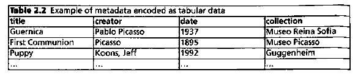

Conceptualmente, la visión del mundo que crea con datos tabulares se compone de columnas y filas. La intersección de una columna con una fila da significado a los datos contenidos en la celda en particular. La figura 2.1 ilustra este modelo de datos en un nivel abstracto. Solo hay una dimensión de modelado, que consta de los campos de la primera fila de encabezado. Cada fila contiene datos de diferentes entidades semánticas, a las que también podemos referirnos como registros. Esta es la razón por la que los datos tabulares se denominan a menudo archivos planos. Volviendo a nuestro ejemplo concreto, es un acto intuitivo utilizar este modelo y elaborar una lista como se presenta en la Tabla 2.2, que ilustra cómo puede desarrollar una descripción tabular de sus recursos.

Durante siglos, los catálogos e índices se codificaron en esta forma tabulada.
La lista, como la mayoría de la gente llamaría datos tabulares, probablemente pueda considerarse como la tecnología de la información más antigua. La elaboración de listas organizadas en columnas sigue siendo a menudo el primer paso que se da cuando se hace una lluvia de ideas y se desarrollan ideas sobre qué elementos de metadatos deben utilizarse para documentar un recurso. ¿Por qué es este un modelo de datos tan intuitivo? Los datos tabulares ofrecen la gran ventaja de que casi se explican por sí mismos. Al leer un catálogo o un índice en este formato,
tiene una tendencia natural a leer de forma horizontal centrándose en una línea del catálogo y leyendo de izquierda a derecha la información recopilada en los diferentes "recuadros". Esto le permite obtener una descripción general inmediata de todos los diferentes elementos de metadatos (en nuestra tabla: título, creador y fecha) relacionados con un objeto específico. Los semiólogos o lingüistas se referirían a la importancia de las relaciones sintagmáticas. Mediante la combinación de diferentes elementos, se crea significado en el sentido de que entendemos qué es un objeto, cuándo fue creado y por quién. Una lectura vertical, mirando hacia arriba y hacia abajo de las columnas, le permite tener una idea de los diferentes valores de un elemento de metadatos específico. En este nivel operan las llamadas relaciones paradigmáticas. Estas relaciones agrupan a miembros de la misma categoría.

La diferencia y la interacción entre sintagmático y paradigmático
las relaciones pueden parecer una nota al margen de la academia pedante. Tenga en cuenta que juegan un papel importante en la comprensión de la diferencia entre el uso de descripciones no estructuradas, a las que podemos referirnos como narrativas, y los campos de metadatos estructurados, que se han dividido para hacerlos más procesables por máquina. Lev Manovich llamó la atención sobre la diferencia fundamental entre estas dos formas de presentar información:

_Como forma cultural, una base de datos representa el mundo como una lista de elementos y se niega a ordenar esta lista. Por el contrario, una narración crea una trayectoria de causa y efecto de elementos aparentemente desordenados. Compitiendo por el mismo territorio de la cultura humana, cada uno reclama un derecho exclusivo a darle sentido al mundo. A la base de datos (el paradigma) se le da existencia material, mientras que la narrativa (el sintagma) se desmaterializa. Se privilegia el paradigma, se minimiza el sintagma. El paradigma es real, el sintagma es virtual._

   Manovich, 2001, 231

Tradicionalmente, la gente ha privilegiado la forma de narrativa al comunicar información, pero la presencia masiva de aplicaciones basadas en bases de datos en la web está revirtiendo la situación. Esta evolución está muy plasmada en cómo han evolucionado nuestras prácticas de metadatos. Desde principios del siglo XX, nuestras instituciones de patrimonio cultural han comenzado a descomponer las largas descripciones narrativas elaboradas por los curadores y las han trasladado a catálogos de fichas y registros de bases de datos. Esta evolución ayudó drásticamente a facilitar la búsqueda y la recuperación, pero en realidad dar sentido a un objeto complejo todavía se basa en la descripción no estructurada. Manovich va demasiado lejos al presentar las dos formas como exclusivas y competitivas. Es la introducción de sitios web basados ​​en bases de datos lo que hizo posible la llegada de las aplicaciones web 2.0. Como lo demostrará el Capítulo 5, los comentarios de los usuarios pueden ofrecer un enriquecimiento valioso de los metadatos limitados que una institución puede proporcionar, mientras que el reconocimiento de entidades nombradas (NER)
actualmente se puede aplicar para facilitar procedimientos complejos de búsqueda y recuperación basados ​​en texto completo no estructurado en lenguaje natural.

2.2 Serialización

Los formatos de serialización más populares de datos tabulares son los valores separados por comas (CSV) y los valores separados por tabulaciones (TSV). La única, pero importante, diferencia entre estos dos formatos son los caracteres, apropiadamente llamados delimitadores, que se utilizan para indicar la separación entre valores. Como su nombre lo indica, los archivos CSV usan una coma como delimitador y pestañas TSV. Tenga en cuenta que se puede utilizar cualquier tipo de carácter como delimitador. Los datos CSV de la Tabla 2.2 están separados por una coma y las filas terminan con un salto de línea de la siguiente manera:

<kbd>título, creador, fecha, colección 
Guernica, Pablo Picasso, 1937, Museo Reina Sofía 
Primera Comunión, Picasso, 1895, Museo Picasso 
Perrito. "Koons, Jeff", 1992, Guggenheim 
</kbd>

La versión de TSV se vería exactamente igual, pero las comas serían reemplazadas por tabulaciones. Y estrictamente hablando, las citas de Koons, Jeff
