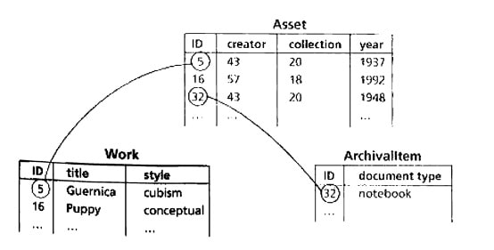

La sección anterior sobre el formato tabular describió el poco impacto que tiene el cambio en la estructura de un archivo plano. Agregar nuevas columnas o eliminar las existentes no altera fundamentalmente cómo se pueden usar los datos tabulares. La situación no podría ser más diferente con las bases de datos relacionales. Agregar una tabla adicional requiere que el administrador de la base de datos reconsidere todo el esquema de la base de datos, ya que agregar una tabla adicional podría implicar una degradación del proceso de normalización.

Volvamos a nuestro ejemplo. Imagine que queremos agregar una entidad <var>Archivelltem</var> que describe los fondos de archivo de un artista que posee la institución, como correspondencia, notas, fotografías personales, recortes de prensa históricos, etc.

¿Cómo actualizamos nuestra base de datos con el mínimo esfuerzo? Podemos crear una tabla `Archivalltem` con los atributos `ID`, `document type`, `year`, `creator` y `collection`.  Entonces el cambio puede ocurrir simplemente agregando esta única tabla. Sin embargo, esa tabla tendría una superposición considerable con `Trabajo`, ya que ambos tienen un creador, una colección y un año. Esta difusión de información se vuelve difícil de gestionar al final. Si queremos respetar los requisitos de normalización, no podemos simplemente agregar tablas adicionales, sino que también necesitamos modificar las tablas existentes.
La figura 2.3 muestra una solución mejor integrada: los atributos comunes de `Work` y `Archivailtem` se colocan en una tabla `Asset` separada.

Figura 2.3 Para admitir elementos de archivo de manera coherente, los campos `creator`, `collection` y `year` deben moverse de la tabla `Work` a una tabla compartida `Asset`

Sin embargo, esto significa que la tabla existente y la estructura de datos deben modificarse. Además de garantizar la normalización del nuevo esquema de la base de datos, las modificaciones también afectan a los sistemas externos, como el front-end público creado para dar acceso a los datos en la web.
Realizar este tipo de actualizaciones y modificaciones cada dos meses puede resultar muy engorroso. 
En la práctica, estas modificaciones a menudo se evitan, ya que no hay tiempo para repensar fundamentalmente la estructura de la base de datos. En este contexto, las personas a menudo confían en soluciones ligeras y ad hoc, como la creación de una hoja de cálculo independiente.

Este tipo de decisión a corto plazo provoca, durante un período de años, problemas tremendos con la coherencia de los datos, ya que los datos de referencia se agrupan en diferentes aplicaciones. Por lo tanto, podemos concluir que actualizar y mantener una base de datos no es un asunto trivial, debido a la complejidad de modificar el esquema de la base de datos.