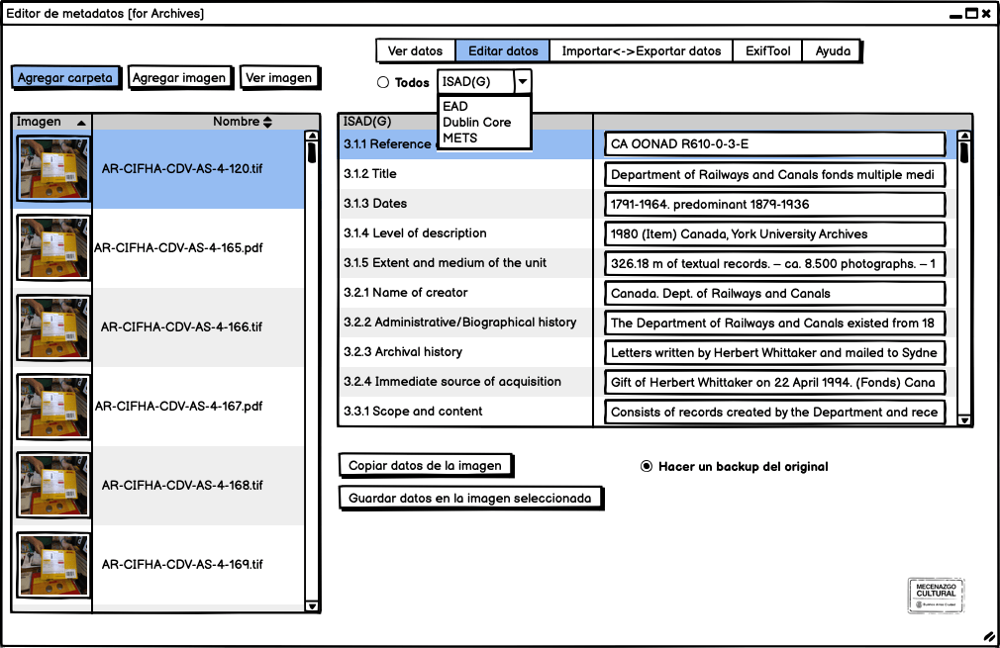

Este editor multiplataforma es una herramienta gráfica para la edición de metadatos de registros de colecciones con las normas [Dublin Core](https://dublincore.org/specifications/dublin-core/), [ISAD(G) 2000](https://www.ica.org/sites/default/files/CBPS_2000_Guidelines_ISAD%28G%29_Second-edition_EN.pdf), [EAD 2002](https://www.loc.gov/ead/index.html)

## Contexto en Argentina
La Secretaría de Cultura de la Nación (Argentina), en su resolución 1070, [https://senip.cultura.gob.ar/wp-content/uploads/2016/09/Res-1070.pdf] instruye a los organismos dependientes adoptar una ficha de registro de inventario de unidades documentales de acuerdo a la norma ISAD(G); pero no documenta su adaptación local de la norma, como tampoco regula ni sugiere como implementarla. Muchas otras instituciones o archivos utilizan estas normas y carecen de herramientas apropiadas para el registro de documentos.

## Objetivos
Esta herramienta busca ayudar, tanto al archivista iniciado como al experimentado, a implementar las normas en una única interfase, evitando la dispersión de soluciones y colaborando con la estandarización de los procesos y la aplicación de las normas.

## Características
* Edita metadatos según las normas internacionales Dublin Core, ISAD(G) 2000, EAD 2002
* Edita metadatos según la adaptación local de la norma ISAD(G)
* Edita los metadatos y los 'guarda' dentro del archivo (ej.: jpg, tif, pdf) conservando su contexto al viajar a través de software, dispositivos y bases de datos.
* Aunque lo permite, hace obsoleto el uso de hojas de cálculo independientes para el registros de colecciones
* Exporta los metadatos a un archivo tabulado (CSV) o un XML
* No es destructivo (no altera las imágenes)
* Reduce significativamente las tareas de registro
* Adaptado a un flujo de trabajo para auditoría de datos con [Open Refine](https://openrefine.org/)
* Puede generar un archivo XML para la exportación de metadatos a otras plataformas, como [AtoM](https://accesstomemory.org/), [Archivematica](https://www.archivematica.org/), [DSpace](https://duraspace.org/dspace/), [Fedora Commons](https://duraspace.org/fedora/) o [RODA](https://roda-community.org/).

### Características extendidas
* Importa un CSV o XML y guarda los metadatos en archivos (ej.: jpg, tif, pdf)
* Lectura/escritura de metadatos en un archivo XML externo (sidecar)
* Guarda un histórico de ediciones
* Soporte para EAD3(2015)

## Software
Aplicación Java/Swing que funciona como frontend gráfico (GUI) para ExifTool. La UI está diseñada con GUI Designer from IntelliJ IDEA. 

Licencia abierta, GNU General Public License

## Mockups

