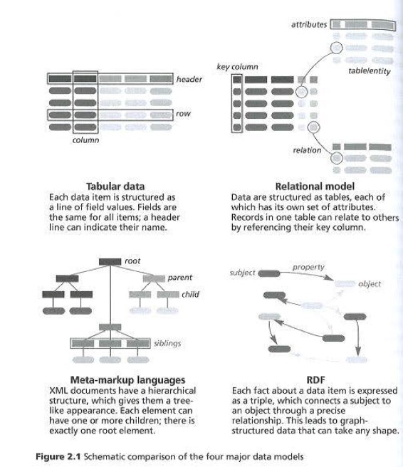

Por lo tanto, en este capítulo, alejémonos de la visión meramente impulsada por la sobreexpectación de los datos vinculados eligiendo un enfoque más conceptual e histórico. 

Para aprovechar el potencial, pero también los límites, de los datos vinculados, necesitamos una mejor comprensión de los diferentes modelos de datos que se han utilizado durante las últimas décadas para administrar metadatos. 
Las ventajas de RDF, el modelo de datos subyacente a la visión de datos vinculados, sólo pueden entenderse completamente en el contexto de modelos de datos anteriores. Al final de este capítulo comprenderás que los diferentes modelos de datos presentados no se suplantan entre sí, sino que continúan coexistiendo.

<mark>La descripción general de los diferentes modelos debe dejar en claro que las bases de datos relacionales llegaron para quedarse y no se eliminarán en favor de las tripletas.</mark> 

Los proveedores de tecnología y los investigadores de TI tienden a enfatizar demasiado el papel que desempeña la nueva tecnología. En el apogeo de la popularidad de XML, a veces uno tenía la impresión de que el back-end de cualquier tipo de sistema de información se volvería basado en XML. Una década después, XML se critica con más frecuencia y a menudo se prefieren nuevos formatos de serialización como JSON. 

<mark>Nos centraremos específicamente en la descripción general ofrecida en este capítulo sobre la gestión de datos estructurados, pero ten en cuenta que las barreras tradicionales entre datos estructurados y no estructurados se están volviendo cada vez más borrosas.</mark>

Durante décadas, diferentes comunidades han estado trabajando de forma independiente en ambos temas. Los ingenieros de bases de datos se centran en la optimización de la gestión de datos estructurados, mientras que los lingüistas computacionales desarrollan métodos y herramientas para gestionar el lenguaje natural no estructurado de forma automatizada. Las diferentes tradiciones y puntos de vista entre las dos comunidades se pueden ilustrar analizando cómo ambas comunidades utilizan XML. Los ingenieros informáticos ven XML como un árbol jerárquico en el que se pueden codificar datos estructurados para facilitar la comunicación de datos entre máquinas. Por otro lado, los lingüistas computacionales y los humanistas digitales ven XML como un método para insertar pequeñas piezas de estructura en un documento textual que de otro modo no estaría estructurado.

Indicar dónde exactamente en un texto completo se pueden encontrar los nombres de lugares o personas permite a los académicos automatizar hasta cierto punto el análisis de un corpus no estructurado. <mark>La distinción tradicional entre datos estructurados y no estructurados es particularmente problemática en el contexto de los metadatos.</mark>
Por ejemplo, dentro de un registro de metadatos altamente estructurado, puede aparecer un campo descriptivo que contenga una narración de varias páginas de texto completo no estructurado. ¿Este registro de metadatos debe considerarse estructurado o no estructurado?

El capítulo comenzará con el modelo más intuitivo para estructurar datos, que son los formatos tabulares. Debido a las limitaciones de este enfoque, el modelo relacional se desarrolló en la década de 1970, siendo hasta hoy el estándar para representar y administrar datos complejos. Como se explicará en las próximas secciones, la aparición de la web a finales de la década de 1990 catalizó la necesidad de portabilidad de datos. 

Compartir datos entre diferentes bases de datos es un proceso muy tedioso, por razones que se explicarán a continuación. Con el fin de facilitar el intercambio de datos estructurados en web, desde el año 2000 se han utilizado lenguajes de metamarcado y XML en particular. XML propone una sintaxis estandarizada para el intercambio automatizado de datos estructurados, pero el uso y la interpretación reales de los datos aún pueden resultar problemáticos. 

<mark>El significado de los elementos y atributos de los archivos XML deben definirse en un esquema.</mark> La interpretación del esquema sigue siendo una barrera para un consumo automatizado de datos en los sistemas de información de la web. <mark>Es exactamente aquí donde entra RDF. Al adoptar un modelo de datos que encarna el significado de los datos en su forma más esencial y simplificada, ya no es necesario un esquema externo para interpretar y reutilizar los datos.</mark>

La figura 2.1 compara los diferentes modelos desde una perspectiva de alto nivel. Podría considerar esta figura como una descripción general sintética del Capítulo 2. 

Somos conscientes de que estamos cubriendo mucho terreno con este capítulo. A veces, puede resultar difícil comprender la interacción y los vínculos entre los cuatro modelos de datos diferentes que se discutirán. 
Para ayudarlo a poner las secciones individuales de este capítulo en una perspectiva más amplia, <mark>la Figura 2.1 destaca de manera abstracta las características de cada modelo de datos.</mark> Aunque cada modelo tiene sus propias propiedades, las similitudes se han resaltado en la medida de lo posible. Por ejemplo, las formas redondeadas representan valores de datos individuales; las formas rectangulares indican formas específicas del modelo para agregar estructura (con la excepción de RDF, donde se usan flechas).

_Los diferentes tonos indican valores de datos que semánticamente pertenecen juntos, lo que indica cómo los tratan los diferentes modelos._

**Datos tabulados**
Cada elemento de datos está estructurado como una línea de valores de campo. Los campos son los mismos para todos los elementos; una línea de encabezado puede indicar su nombre.

**Modelo relacional**
Los datos están estructurados como tablas, cada una de las cuales tiene su propio conjunto de atributos. Los registros de una tabla pueden relacionarse con otros haciendo referencia a su columna clave.

**Lenguajes de metamarcado**
Los documentos XML tienen una estructura jerárquica, lo que les da una apariencia de árbol. Cada elemento puede tener uno o más hijos; hay exactamente un elemento raíz.

**RDF**
Cada hecho sobre un elemento de datos se expresa como un triple, que conecta a un sujeto con un objeto a través de una relación precisa. Esto conduce a datos estructurados en gráficos que pueden tomar cualquier forma.