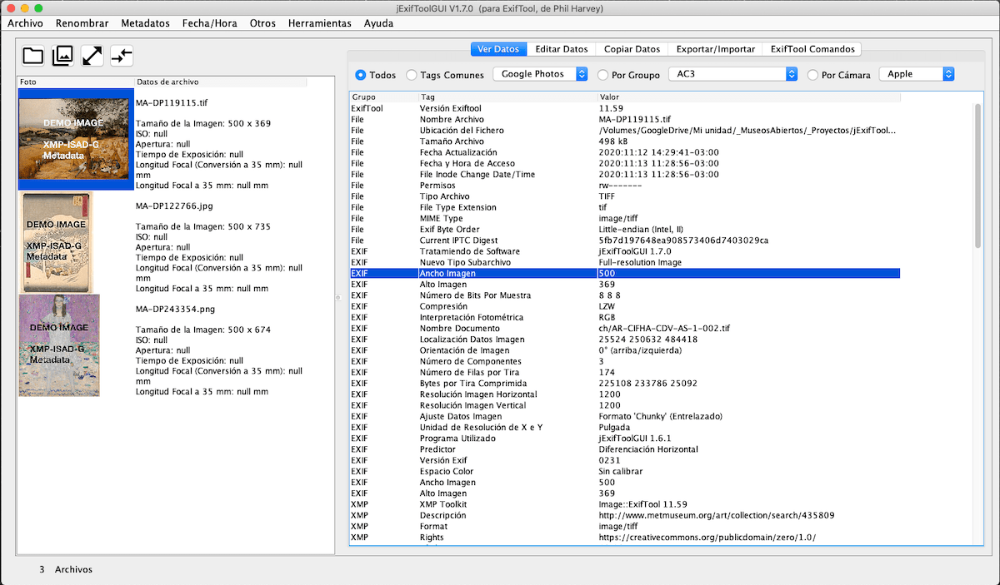
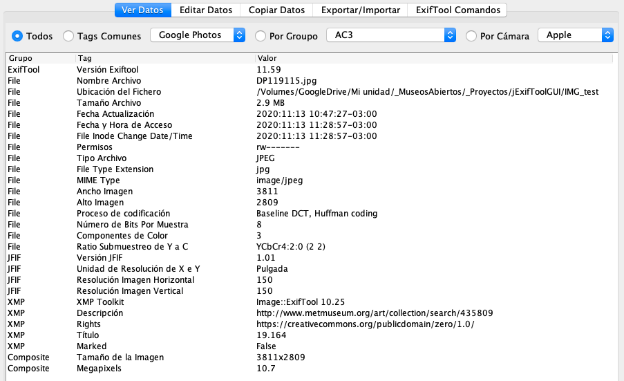
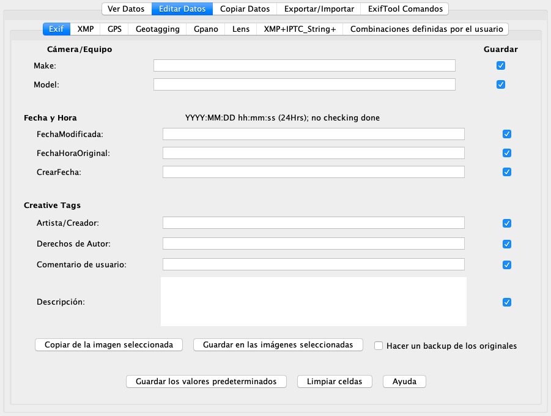
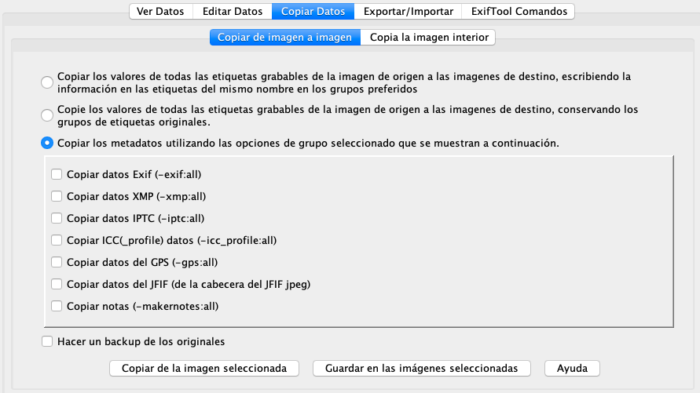
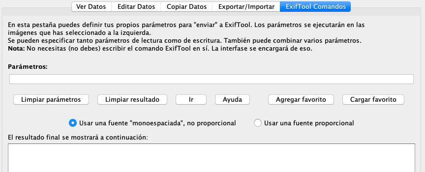
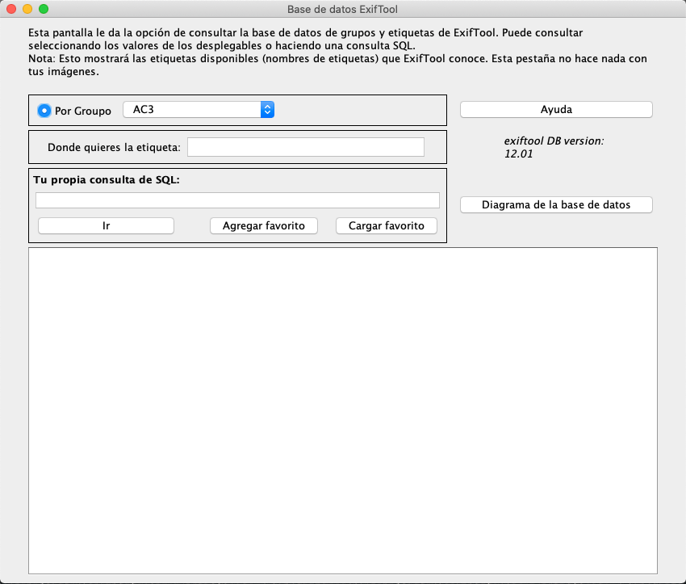
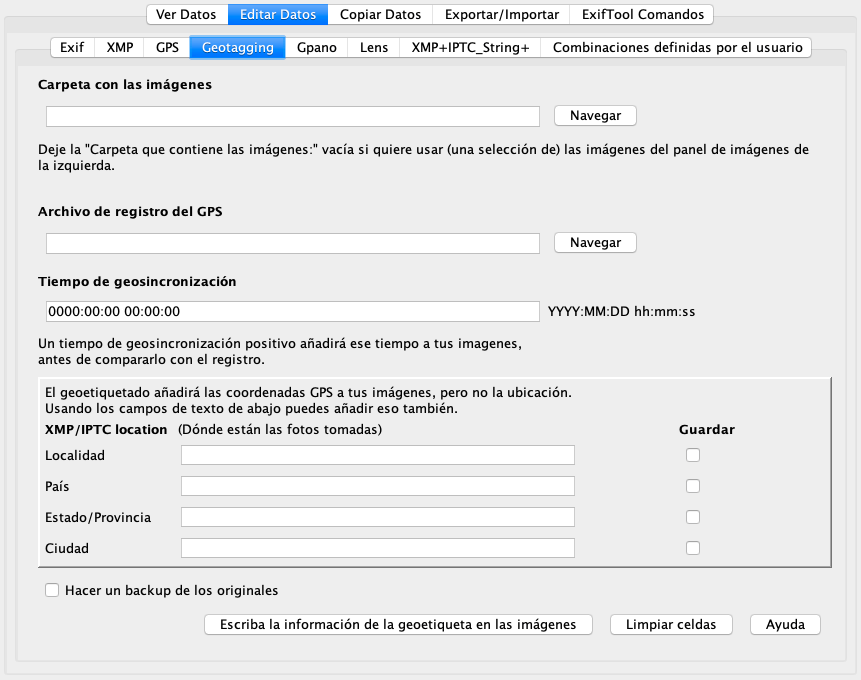
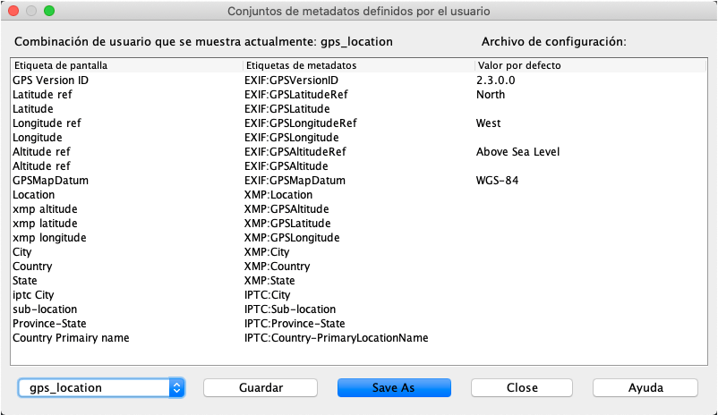
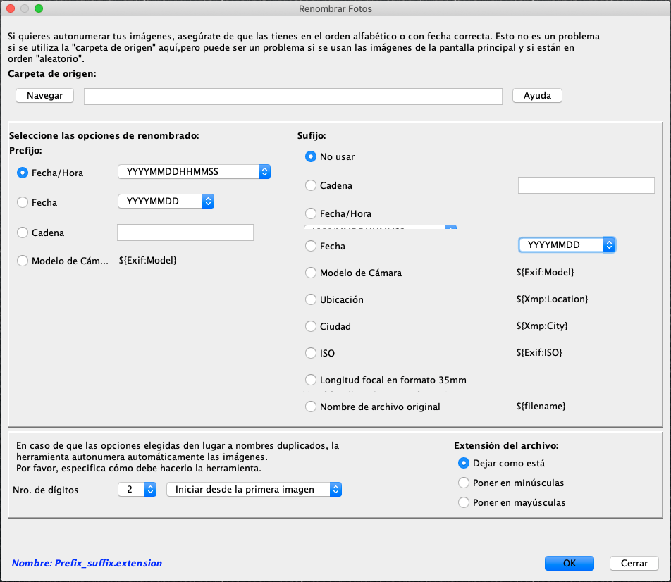
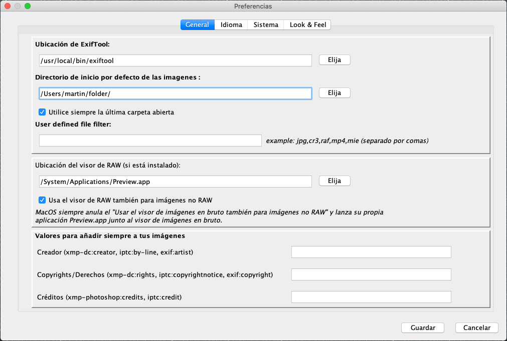

# jExifToolGUI: una GUI multiplataforma [Java Swing] para ExifTool

!!! [See Online Manual (in English)](https://hvdwolf.github.io/jExifToolGUI/manual/)

! Última modificación: 2020-11-13

## 1. Visión general
**[jExifToolGUI](https://hvdwolf.github.io/jExifToolGUI/)** es un programa Java Swing que lee y escribe metadatos de archivos, predominantemente archivos de imágenes. Tiene algunas pantallas preformateadas para Exif, GPS/ Localización, XMP, GPano (y un conjunto muy limitado de etiquetas IPTC) para leer/escribir desde/hacia archivos de imagen usando [ExifTool](https://exiftool.org/) y también soporta geo-etiquetado. Además, puedes definir tu propia combinación de etiquetas de metadatos para escribir en tus imágenes. 
Esto te da la opción de usar cualquier etiqueta que [ExifTool](https://exiftool.org/) soporte. Además, también puedes definir etiquetas "totalmente nuevas" no existentes que pueden ser añadidas a sus archivos utilizando un archivo de configuración 'definido por el usuario' y una combinación de etiquetas definidas por el usuario. 
[jExifToolGUI](https://hvdwolf.github.io/jExifToolGUI/): '**j**' por Java, ‘**GUI**' por interfaz gráfica de usuario de [ExifTool](https://exiftool.org/).

[jExifToolGUI](https://hvdwolf.github.io/jExifToolGUI/) es sólo una interfaz gráfica para la excelente aplicación, de línea de comandos de código abierto en Perl, [ExifTool by Phil Harvey](https://exiftool.org/). [ExifTool](https://exiftool.org/) es el verdadero "motor", pero como es una herramienta de línea de comandos es para algunos usuarios menos amigable. [jExifToolGUI](https://hvdwolf.github.io/jExifToolGUI/) está construido alrededor de [ExifTool]() e intehttps://exiftool.org/nta dar muchas funcionalidades y flexibilidad sin tener que recordar cada parámetro de la línea de comandos. [jExifToolGUI](https://hvdwolf.github.io/jExifToolGUI/) sólo implementa parte de la funcionalidad de [ExifTool](https://exiftool.org/). Definitivamente no es un GUI completo para [ExifTool](https://exiftool.org/) y ciertamente no puede reemplazarlo (ExifTool es el motor "bajo el capó").

Este programa es de código abierto y completamente gratuito y siempre se mantendrá así, pero puedes donarme cualquier cantidad para mostrar tu agradecimiento si continúas usándolo (después de todo, me llevó muchas horas/días escribirlo). Mira el menú de Ayuda en el programa o [haz clic aquí](https://hvdwolf.github.io/jExifToolGUI/donate.html).
Y cuando se trata de la donación, lo mismo es válido, por supuesto, para la propia [ExifTool](https://exiftool.org/). Para la donación a Exiftool (Phil Harvey), [ver aquí](https://exiftool.org/#donate).

Este manual y la versión de [jExifToolGUI](https://hvdwolf.github.io/jExifToolGUI/) no siempre funcionan sincrónicamente. Si se añade una nueva funcionalidad al programa que requiera un nuevo capítulo o párrafo, el manual se actualizará para esa nueva sección. Sin embargo, no todas las partes del manual serán/podrán ser actualizadas, lo que podría llevar a pantallas de programas más antiguos en el manual que podrían desviarse ligeramente de la versión del programa con el que se está trabajando.
Ten en cuenta también que verás capturas de pantalla de varios sistemas operativos (Linux/Windows/MacOS) y/o gestores de ventanas (en Linux).

! Este manual se trabajará y se ampliará lentamente. Actualmente se encuentra en su infancia.

## 2. Versiones e "Instalación"
Esta herramienta está escrita en Linux, se usa en Linux y se prueba principalmente en Linux. Sin embargo, como es un programa multiplataforma de Java Swing debería funcionar bien en MacOS, Windows y teóricamente en todas las plataformas que soportan Java.

**Nota:** jExifToolGUI viene sin ExifTool, el cual debes descargar tú mismo del [sitio de ExifTool de Phil Harvey](http://www.sno.phy.queensu.ca/~phil/exiftool/) si quieres la última versión. En Linux también puedes usar la versión perteneciente a tu distribución.

### Universal jar
* `jExifToolGUI.jar`: Sólo el jExifToolGUI.jar desnudo, que contiene todas las dependencias. Necesitas tener la versión 8 (1.8) o más reciente de Java instalada en tu sistema.
Empieza desde una terminal con `java -jar jExifToolGUI.jar &.` Esta versión debe funcionar en cualquier sistema que venga incluido con java 8 o más reciente, o donde puedas instalar java 8 o más reciente. (Windows/Linux/MacOS (BSD*unix)/Solaris/AIX/HP*UX etc.)

### Windows
* `jExifToolGUI-<version>-win-x86_64_with-jre.zip`: Un ejecutable de 64 bits de Windows, incluyendo el Java V11. Descomprimir con las rutas!
* `jExifToolGUI-<version>-win-x86_64.zip`: Un ejecutable de 32/64 bits de Windows sin Java. Necesitas tener instalado en tu sistema el Java 8 (1.8) o uno más reciente.

Ambas versiones no vienen con instaladores. Simplemente descomprime (con rutas) en una carpeta de tu agrado y opcionalmente crea un acceso directo en tu escritorio.

### MacOS
* `jExifToolGUI-x86_64-macos-<version>-with_jre.dmg.zip`: Un paquete MacOS que incluye el Java V11. Nota: Apple es muy poco amigable con las cosas que no son de Apple como Java/Perl y otros softwares. Este paquete ES un paquete de Apple que funciona, pero no cumple totalmente con los estándares de Apple.
* `jExifToolGUI-x86_64-macos-<version>.dmg`: Un paquete de MacOS sin Java. Necesitas tener instalado en tu sistema el Java 8 (1.8) o uno más reciente.

Estos son paquetes de aplicaciones MacOS. En el caso de la versión completa, primero tienes que descomprimirla para obtener el archivo dmg. Abre el dmg (haciendo doble clic en él) y selecciónalo en el panel de navegación izquierdo de tu Finder, donde aparecerá como "disco virtual" (Los archivos DMG son archivos de imagen de disco con formato Mac). Arrastra el paquete "jExifToolGUI.app" de la dmg a la carpeta Aplicaciones o alguna otra de tu gusto.

**Note:** MacOS (el software Gatekeeper) normalmente no permite que se inicien aplicaciones que no se originen en la AppStore o que provengan de un desarrollador "no identificado" (yo). Necesitas añadir jExifToolGUI a la "lista de excepciones". Eso es en realidad muy simple. Ver soporte de Apple.

### Linux 
* `jExifToolGUI-<version>.deb`: Un paquete Linux.deb. para todos los sistemas basados en Debian (Debian/Ubuntu/Mint/MX Linux/Raspbian etc.). Esta es una versión multiarquitectura de Linux, ya que la versión relevante de Java V11 para su sistema/arquitectura será descargada como dependencia.
Usa `sudo dpkg -i jexiftoolgui-<versión>.deb` para instalar. A partir de ese momento también aparecerá en tu menú.
* `jExifToolGUI-<version>-x86_64.AppImage`: Linux universal Appimage incluyendo Java V11. Funciona en todos los sistemas Linux de 64 bits (y también dentro de la beta de Chromebook Linux).
Simplemente haz un `chmod +x jExifToolGUI-<version>-x86_64.AppImage` y ejecuta `./jExifToolGUI-<version>-x86_64.AppImage &.`

### 2.1 Desinstalar

Si usas el paquete deb en cualquier sistema operativo Debian/Ubuntu como Linux, puedes usar apt-get o dpkg para desinstalarlo.
**Nota**: Todas las demás versiones, ya sean los paquetes de MacOS, o los de Windows .exes o linux appImage pueden ser simplemente borrados.

* Datos de usuario y datos de programa: En tu carpeta de usuario, encontrará una carpeta _jexiftoolgui_data_. Simplemente elimina esa carpeta.
* Logs: jar/Windows exe/appImage: En la misma carpeta donde se ejecuta la aplicación encontrarás una carpeta de registros. Simplemente elimínala.
Para los paquetes de MacOS y el jexiftoolgui.deb, los registros se escriben en registros de carpeta dentro de su carpeta de "/Users/(usuario)" Simplemente elimina la carpeta de registros.

## 3. Inicio rápido
El programa consiste en un panel izquierdo que contiene tus fotos y un panel derecho que consiste en un conjunto de pestañas. Una de estas pestañas ("Editar") contiene un subconjunto de pestañas (algunas de las subpestañas de la pestaña "Editar datos” serán tratadas en este manual para una mayor explicación).
Junto a las pestañas de la derecha, el programa también tiene varios menús que contienen más funcionalidades. Algunos botones y funciones no funcionarán, y están deshabilitados, hasta que no se haya cargado al menos una foto. La mayoría de las acciones sobre las imágenes que se realizan en las pestañas de la derecha o en los menús, sólo funcionan después de haber seleccionado al menos una o más de las fotos cargadas en el panel de la izquierda.

### Ver datos
Selecciona una imagen y haga clic en uno de los radiobotones y luego selecciona la categoría de metadatos deseada en el desplegable. Las "Etiquetas comunes" no son la categoría "común" de ExifTool, pero lo que el autor considera son "categorías comúnmente seleccionadas". Las "combinaciones de etiquetas de metadatos definidas por el usuario" (ver sección "4.3 Create and use user defined metadata tag combinations") también se añaden a este desplegable. Si tienes varias imágenes seleccionadas, se mostrarán los metadatos de la última imagen seleccionada.

### Editar datos
Aquí también; todas las acciones de la pestaña derecha "Editar" sólo funcionan después de haber seleccionado una o más de las fotos cargadas.

* Puedes seleccionar una imagen y modificar los datos de la misma.
* Puedes seleccionar varias imágenes a la vez y modificar los datos de todas ellas a la vez.
* Puedes seleccionar una imagen, copiar los datos de la misma, luego seleccionar varias imágenes y pegar los datos (copiados) en estas imágenes a la vez.

Todas las subpestañas de edición tienen una "línea inferior" de botones “Copiar de la imagen seleccionada", “Guardar en las imagenes seleccionadas" y “Ayuda".

Como se menciona en el punto #3: Puede copiar la información relevante de una imagen seleccionada. Luego puede escribir esta información en muchas imágenes.
Nota: En (menú) "Metadatos -> Exportar Sidecar" puede exportar los metadatos a varios de formatos. Especialmente MIE es un excelente formato para exportar. Puede leer el formato MIE como una imagen y usarlo para "Copiar desde".

Algunas de las subpestañas de la pestaña "Editar datos” se verán en este manual para una mayor explicación.

### Copiar datos
Esta opción permite copiar categorías enteras de metadatos de una imagen a múltiples imágenes.

### Commandos ExifTool
Este programa tiene muchas funcionalidades y flexibilidad en la forma en que puede leer/escribir la fecha desde y hacia sus imágenes. En caso de que eso no sea suficiente, puedes simplemente crear tu propio comando y ejecutarlo en tus imágenes. Además, puedes guardar tus comandos como "favoritos" para usarlos repetidamente más tarde.

### Base de datos de ExifTool
Esta pestaña no hace nada con sus imágenes. Es simplemente una herramienta para consultar a través de todas las categorías de metadatos y etiquetas que ExifTool soporta. El número de etiquetas depende de la versión de ExifTool. La pestaña menciona en qué versión se basa la información recuperada (no tiene que ser la versión que tiene instalada en su equipo). También aquí puede guardar sus consultas SQL como favoritas.

## 4. Algunas subpestañas de edición explicadas
En este capítulo se explicarán con más detalle algunas de las pestañas de edición. Otras como Exif, XMP y GPS/localización son demasiado directas para decir algo sobre ellas.

### 4.1 Geotagging
El geoetiquetado añade datos GPS a las imágenes basándose en los datos de un archivo de registro de seguimiento de GPS.
Este archivo de rastreo de GPS se puede usar desde el teléfono, el dispositivo gps, el dispositivo de navegación o cualquier otro dispositivo que proporcione dicho rastreo de GPS.
Se carga el archivo de registro de rastreo del GPS y se utiliza la interpolación lineal para determinar la posición del GPS en el momento de la imagen, luego se escriben las etiquetas pertinentes en la imagen (si se dispone de la información correspondiente). Esto significa que la cámara debe estar correctamente ajustada con respecto a la fecha/hora del lugar en el que se encuentra.

jExifToolGUI también soporta la función "Geosync" de ExifTool. La etiqueta Geosync sólo es necesaria cuando las marcas de tiempo de la imagen no están correctamente sincronizadas con la hora del GPS.
Por ejemplo, un valor de "+1:20" especifica que se añade 1 minuto y 20 segundos al valor de geotiempo antes de comprobarlo con el archivo de seguimiento del GPS. Esto es para una cámara que funciona 1 minuto 20 segundos más lento que el reloj del GPS.
El tiempo de Geosync se especifica como "SS", "MM:SS", "HH:MM:SS" o "DD HH:MM:SS" (donde SS=segundos, MM=minutos, HH=horas y DD=días), y se puede añadir un "+" o "-" para las diferencias positivas o negativas.
**Nota:** No uses (dobles) citas alrededor del tiempo de geosincronización en jExifToolGUI. Simplemente usa algo como -25 o +1:20

**En jExifToolGUI tienes 2 opciones:**

* Utiliza (una selección de) las imágenes que has cargado en el panel de imágenes de la izquierda.
* Especifique una carpeta que contenga un conjunto de imágenes a etiquetar.

En el caso de la primera opción es necesario dejar la carpeta vacía. Si la "Carpeta que contiene las imágenes:" no se deja vacía, siempre utilizará la segunda opción que es la carpeta.

"Hacer copia de seguridad de los originales" puede hacer copias de seguridad cuando se selecciona. Cuando se selecciona, se crearán nuevas imágenes y las imágenes originales obtendrán la extensión” .original".
**Nota:** jExifToolGUI escribirá tanto las etiquetas GPS EXIF como las etiquetas GPS XMP.

### 4.2 Usar lentes y crear 'plantillas de lentes' para sus lentes
Esta pantalla tiene dos propósitos:

* Agregar/quitar datos de la lente en tus fotos (primera fila de botones)
* Crear/Modificar la configuración de una lente (segunda fila de botones encerrada dentro del marco rayado), y en este manual dentro del marco rojo.
  
Ambas opciones se pueden usar para añadir datos de la lente a su imagen si no está completa.

Al margen de esto: Aún así, algunas lentes adicionales no son reconocidas completamente por la cámara y por lo tanto la información no se agrega a la imagen. Para estos casos puedes crear configuraciones de lentes y guardarlas y cargarlas para tus imágenes tomadas con esa lente específica.

Al hacer clic en el botón "Guardar esta configuración de lentes", aparecerá la siguiente ventana emergente.

La configuración de "Cargar una lente" es casi idéntica.

### 4.3 Crear y utilizar combinaciones de etiquetas de metadatos definidas por el usuario
Desde la versión 1.6 de jExifToolGUI le da la opción de definir su propio conjunto de etiquetas de metadatos que quiere añadir a sus imágenes. Incluso puedes definir múltiples conjuntos de combinación de metadatos para diferentes propósitos: paisajes, deportes, archivos, vida salvaje, familia, etcétera. 
La pantalla de mantenimiento se encuentra en el menú "Herramientas -> "Conjuntos de metadatos definidos por el usuario".
La pantalla de edición se encuentra en la pestaña "Editar Datos" dentro de “Combinaciones definidas por el usuario".

Actualmente hay tres conjuntos de metadatos "preinstalados":

* isadg: Los datos de ISAD(G) se añadirán al conjunto de XMP como nueva categoría xmp-isadg. (ISAD(G) es General International Standard Archival Description)
* gps_location: Todos los gps y etiquetas de localización en las 3 categorías EXIF, XMP e IPTC.
* Google Photos: Todas las etiquetas que Google Photos usa o reconoce.

Debajo de la pantalla de mantenimiento y la pantalla de edición.

La pantalla de creación y mantenimiento

La pantalla de edición en la que se utilizan los conjuntos de metadatos definidos para escribir esas etiquetas en las imágenes.

El siguiente video muestra:

* cómo crear combinaciones.
* cómo usar esta combinación en tus imágenes.

Las combinaciones creadas en este video se basan en etiquetas de metadatos ya conocidas por ExifTool. Estas son las etiquetas de metadatos estándar de Exif, XMP, IPTC, etc. Para el 99% de los usuarios esto es todo lo que necesitarán.

#### jExifToolGUI #01: Crear y utilizar combinaciones definidas por el usuario
[plugin:youtube](https://youtu.be/FvTN-pMU7yM)
**Nota:** El video se muestra por defecto en 1024x576 en 480p, pero la resolución máxima es de 1920x1080. (Al reproducirlo, selecciona el icono del engranaje en la barra inferior para ajustarlo a 1080P y haz clic en el icono inferior derecho para reproducirlo a pantalla completa).

Este video muestra las bases.
Los nombres de las etiquetas no se almacenarán en orden alfabético sino en el orden en que los creaste/guardaste.
También puedes cortar/copiar y pegar etiquetas: El segundo video muestra cómo usar Copiar & Pegar desde (o hacia) otras aplicaciones como hojas de cálculo (Excel, Google Spreadsheets, etc.) donde defines tus combinaciones.

#### jExifToolGUI #02: Copiar y pagar combinaciones de usuario
[plugin:youtube](https://youtu.be/8cXT2Aiy6bI)
**Nota:** El video se muestra por defecto en 1024x576 en 480p, pero la resolución máxima es 1920x1080. (Al reproducirlo selecciona el icono del engranaje en la barra inferior para ponerlo en 1080P y haz clic en el icono inferior derecho para reproducirlo a pantalla completa)

##### Creando etiquetas inexistentes para añadirlas a sus imágenes
A continuación sólo se ofrece un breve resumen de lo que se puede hacer.

ExifTool permite definir etiquetas de metadatos que "no existen todavía". Para ello es necesario crear un archivo de configuración personalizado en el que se definen esas etiquetas de metadatos "totalmente nuevas".
Esto se describe en [Sitio ExifTool](https://exiftool.org/config.html)
Otro ejemplo se entrega con el propio jExifToolGUI. Se llama _isadg-struct.cfg_ y se basa en el estándar de archivo ISAD(G) (basado en este esquema XML). El _isadg-struct.cfg_ que he creado se puede encontrar [aquí en línea]
(https://raw.githubusercontent.com/hvdwolf/jExifToolGUI/master/src/main/resources/isadg-struct.cfg), pero también se encuentra en la carpeta jexiftoolgui_data dentro de su carpeta de usuario. (Para asegurarse de que los usuarios no corrompan este archivo, se sobrescribe en cada inicio del programa).
Cuando se desea utilizar etiquetas inexistentes, primero se crea el archivo cfg que contiene estas etiquetas. A continuación, define su conjunto de combinaciones en la pantalla de Herramientas, basándose en los nombres de las etiquetas en su archivo de configuración. Al guardar este conjunto, también se utiliza el selector de archivos para seleccionar el archivo cfg que se ha creado. jExifToolGUI copiará entonces el archivo cfg en la carpeta jexiftoolgui_data y almacenará el enlace entre las etiquetas y el archivo de configuración en la base de datos. Cuando quiera utilizar este conjunto de combinaciones, jExifToolGUI también utilizará el archivo de configuración (tiene que utilizar el archivo, de lo contrario las etiquetas no se pueden escribir).
**Nota:** ExifTool, por lo tanto jExifToolGUI, puede leer esas etiquetas de las imágenes en cualquier momento. Sólo necesitas el archivo de configuración cuando quieras escribir las etiquetas en tus imágenes.

## 5. Varias opciones de menú
En este capítulo se explicarán algunas de las opciones del menú. Algunas porque son algo más complicadas. Otros menús/pantallas porque puede que no sepas cuál es la "utilidad" de estas opciones.

### 5.1 Renombrar fotos
jExifToolGUI te da muchas opciones para renombrar tus fotos. Esto se explicará aquí.
Dentro del marco "a rayas" se ven las opciones de los cuadros desplegables 1 y 2.
El renombramiento tiene 4 "subsecciones": el "prefijo", el "sufijo", la "numeración" y la "extensión" que te dan para un nombre de archivo "prefijo_sufijo_(numeración).extensión".

* prefijo: Esta es la primera parte del nombre. Tienes 4 opciones básicas para elegir, donde las 2 opciones de los desplegables están representadas en el marco a rayas. El campo "Cadena" te da la opción de darle cualquier nombre que quieras con espacios (no se admiten: comillas, comillas dobles, barras oblicuas hacia adelante, barras oblicuas hacia atrás, signos de interrogación, signos de exclamación, dos puntos y comillas (y probablemente más caracteres "extraños").
* sufijo: Esta es la segunda parte del nombre. Tiene (actualmente) 10 opciones para elegir, algunas de las cuales se basan en los metadatos de sus imágenes (éstas también podrían cambiar más tarde a un desplegable). La única observación aquí es que "${nombre del archivo}" es el nombre de archivo original que su cámara da a la imagen como por ejemplo "DSC_1234.NEF" o "P10001234.JPG", etcétera.
* numeración: Si usas un "nombre" (String) o "AñoMesFecha", podrías obtener imágenes con el mismo nombre. Para evitar esto, puede autonumerar las imágenes, dando por ejemplo "exiftool-001.jpg", "exiftool-002.jpg", etc.
* extensión: No se puede cambiar la extensión como tal (un jpg es siempre un jpg). Algunas cámaras/teléfonos usan extensiones en mayúsculas, otras en minúsculas. Si esto te molesta, puedes cambiarlo aquí.

### 5.2 Exportar sidecar
Los metadatos de las imágenes y otros tipos de archivos pueden almacenarse en (exportados a) archivos de metadatos separados. ExifTool soporta y puede crear varios de estos archivos de metadatos. El archivo "sidecar" XMP es probablemente el formato más conocido. Otros tipos de archivos de metadatos soportados son EXIF, XMP, MIE ("El único formato que no apesta") y EXV. jExifToolGUI puede exportar todos los metadatos contenidos en las imágenes y otros archivos que ExifTool soporta, y esto se puede usar a través de (Menú) "Metadata-> Exportar metadatos". Los formatos soportados son TXT, TAB, XML, HTML y CSV.

Las exportaciones de Sidecar se pueden encontrar en (menú) "Metadatos -> Exportaciones de Sidecar". Las exportaciones del Sidecar son ligeramente diferentes.

Todos los archivos de Sidecar pueden ser leídos como "imágenes". Esto hace posible leer (por ejemplo) un archivo .mie junto con un número de imágenes. El archivo de metadatos .mie se utiliza como "Copiar de la imagen seleccionada" y se usa para rellenar una o más imágenes. Por esta razón no existe una función de importación para estos archivos de Sidecar, ya que puede utilizarlos como se acaba de describir.

## 6. Preferencias
Las preferencias se encuentran en el menú "Archivo -> Preferencias"
Actualmente la pantalla de Preferencias tiene 3 pestañas: General (Linux LXDE), Idioma (Windows), Sistema (MacOS).

### La pestaña "General" (izquierda):

* Respecto al "Visor de Imágenes RAW". jExiftoolGUI puede mostrar una gran cantidad de imágenes como jpg/png/tif/bmp/pgm, pero no Imágenes en bruto (puede convertir algunas en miniaturas jpg para verlas en el panel izquierdo), y tampoco la mayoría de los sistemas operativos pueden mostrar imágenes RAW. Así que si tienes imágenes sin procesar y quieres verlas a pantalla completa, necesitas instalar un visor de imágenes sin procesar.
* Valores a añadir siempre a tus imágenes: Estos son 3 campos de entrada que escriben en múltiples etiquetas de metadatos. Las etiquetas XMP e IPTC son usadas por Google Photos y muchos fotógrafos profesionales. Las etiquetas EXIF, algo más antiguas, tienen el mismo propósito pero están un poco desactualizadas.

### La pestaña "Idioma" (arriba a la derecha):

* jExifToolGUI puede ser traducido. jExifToolGUI intentará iniciar en el idioma del sistema operativo, pero sólo si está disponible como "idioma de propiedad" traducido. Actualmente está traducido en inglés (americano), español, alemán y holandés. En esta pestaña puedes seleccionar uno de esos idiomas si lo prefieres sobre el idioma de tu sistema, o en caso de que el idioma de tu sistema no esté soportado pero tu inglés americano no sea tan bueno como tu español o alemán.
* Muchos usuarios de ExifTool han ayudado a traducir la descipción de etiquetas de metadatos en Exiftool. (Esto no tiene nada que ver con jExifToolGUI, sino con ExifTool). Puedes seleccionar un número de idiomas y si la etiqueta está traducida verás la etiqueta en ese idioma.

La traducción de la aplicación en su idioma es un esfuerzo de voluntarios y de la comunidad. [Por favor, ayudanos a traducir esta aplicación](https://hvdwolf.github.io/jExifToolGUI/translate.html).

* La pestaña "Sistema" (abajo a la derecha): Respecto el nivel de registro: No lo pongas muy alto. Eso creará archivos enormes y ralentizará la aplicación (debido a todo el registro). El autor o alguien que te de soporte técnico podría pedirte que lo pongas en el nivel más alto para la búsqueda de problemas.

El "Comprobar si hay una nueva versión de jExifToolGUI al inicio del programa" es útil ya que te informará automáticamente de una nueva versión al inicio.

## Apéndice A. Licencia de Documentación Libre de GNU (en Inglés)
[https://www.gnu.org/licenses/old-licenses/fdl-1.2.html](https://www.gnu.org/licenses/old-licenses/fdl-1.2.html)

